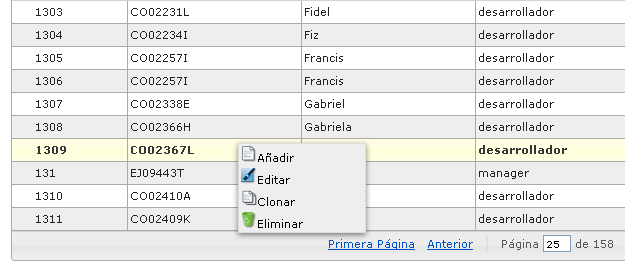

# RUP Table - Menú contextual

El modulo menu contextual (contextMenu) permite mostrar un menú con acciones relacionadas con el lugar del componente sobre el que se muestra.

Por defecto permite realizar sobre los registros de la tabla, las mismas acciones principales que se muestran en la botonera.



## 1. Declaración y configuración

El uso del plugin en el componente se realiza incluyendo en el array de la propiedad usePlugins el valor “contextMenu”.

La configuración del plugin se especifica en la propiedad contextMenu.

```js
$("#idComponente").rup_table({
  url: "../jqGridUsuario",
  usePlugins:["contextMenu"],
  contextMenu:{
  // Propiedades de configuración del plugin contextMenu
  }
});

```

> La configuración de cada uno de los items que se muestran en el menú contextual, se detalla en la guía de uso del patrón Menú Contextual.

## 2. Ejemplo de uso

A continuación se va a mostrar un ejemplo de definición de un caso complejo de las opciones del menú contextual:

```js
$("#idComponente").rup_table({
  usePlugins:["contextMenu"],
  core:{
    operations:{
      "operacion1": {
        name: "Operación 1",
        icon: "rup-icon rup-icon-new",
        enabled: function(){
          return true;
        },
        callback: function(key, options){
          alert("Operación 1");
        }
      },
      "operacion2": {
        name: "Operación 2",
        icon: "rup-icon rup-icon-new",
        enabled: function(){
          return true;
        },
        callback: function(key, options){
          alert("Operación 1");
        }
      }
    }
  },
  contextMenu:{
    colNames:["nombre","apellido1","apellido2","ejie","fechaAlta"],
    items: {
      "sep1": "---------",
      "opContextual1": {
        name: "Op. contextual 1", icon: "edit", disabled:false, colNames:["fechaAlta","fechaBaja","rol"]},   
      "opContextual2": {
        name: "Op. contextual 2", icon: "cut", disabled:true
      }
    },
    showOperations:{
      operacion1:false,
      operacion2: ["nombre","apellido1"]
    }
  }
});
```

A partir del siguiente código se genera lo siguiente:

* Dos operaciones globales (```operacion1``` y ```operacion2```) que serán utilizadas por la toolbar y el menú contextual entre otros.
* Se definen mediante la propiedad items, otras dos opciones extra a ser mostradas como opciones en el menú contextual. Estas opciones serían las identificadas por ```opContextual1``` y ```opContextual2```.
* Los valores indicados en la propiedad colNames determinan que las opciones sobre las que son se especifican columnas concretas donde ser visualizadas, van a ser mostradas en las aquí indicadas.

```js
contextMenu:{
  colNames:["nombre","apellido1","apellido2","ejie","fechaAlta"],
```


* Se determina que la ```operacion1``` no se va a mostrar en el menú contextual y que la ```operacion2``` se va a visualizar solo en las columnas ```nombre``` y ```apellido1```.

```js
showOperations:{
  operacion1:false,
  operacion2: ["nombre","apellido1"]
}
```

* La opción ```opContextual1``` solo se mostrará en las columnas ```fechaAlta```, ```fechaBaja``` y ```rol```.

```js
items: {
  "sep1": "---------",
    "opContextual1": {name: "Op. contextual 1", icon: "edit", disabled: false, colNames:["fechaAlta","fechaBaja","rol"]},
    "opContextual2": {name: "Op. contextual 2", icon: "cut", disabled: true}
},
```
